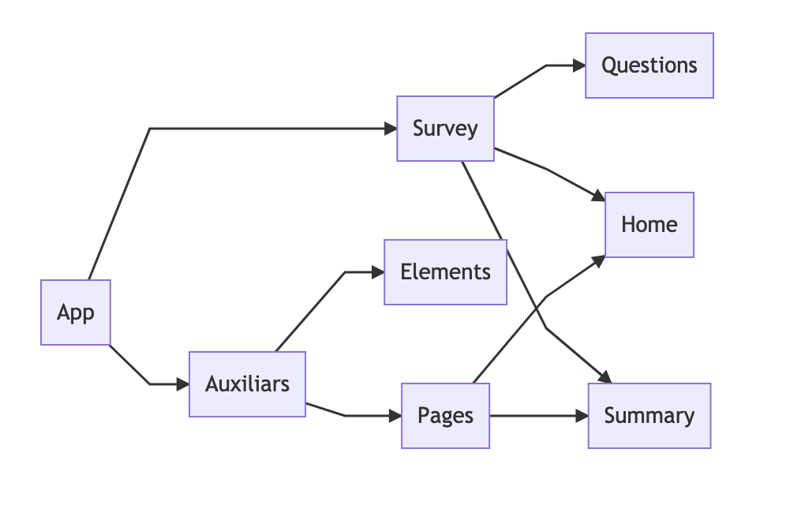
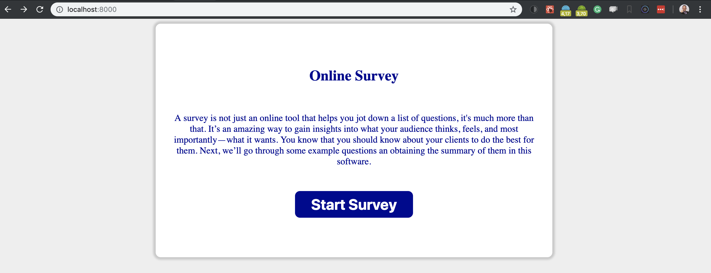
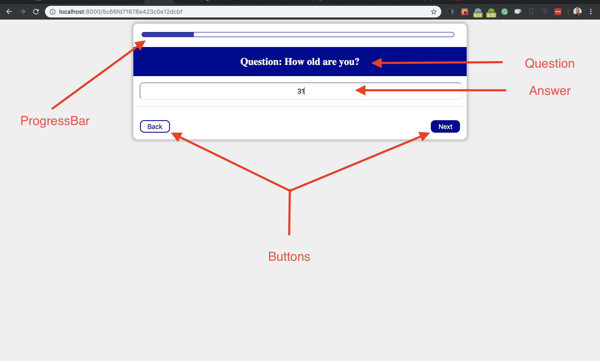
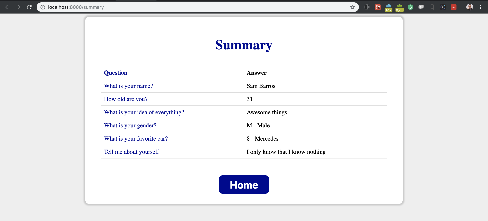
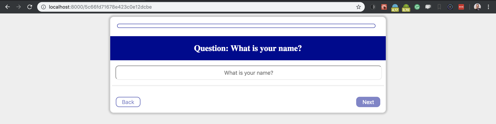
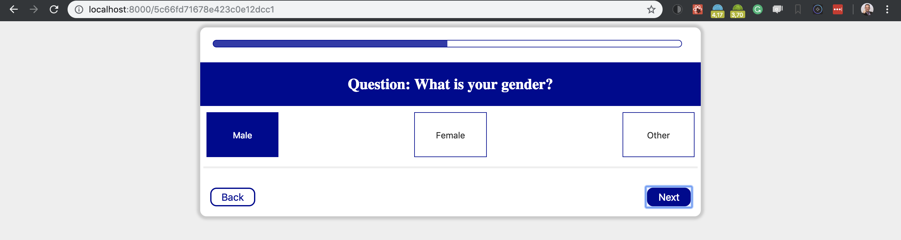
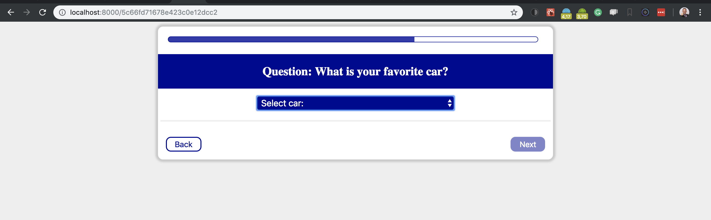

# Liqid's Challenge Test

## Introduction

Welcome to **[Liqid](https://www.liqid.de/de)**

This is the documentation of the [Liqid's Challenge Test](doc/pdf/challenge.pdf). This tools was developed by me, **Sam Barros**, and I show you how to configure and use this tool.

## What you should install?

For this project, I decided to use the MERN (MongoDB, Express.js, React.js and Node.js) technology.


Firstly, you should install

-   [Mongo](https://www.mongodb.com/) 4.0.4+
-   [ExpressJS](https://expressjs.com/) 4.16.3+
-   [ReactJS](https://reactjs.org/) 16.5.0+
-   [Node](https://nodejs.org/en/) 11.4.0+ (It's recommended to use 10.15.1 LTS)

The development enviropment was VS Code

-   [VS Code Studio](https://code.visualstudio.com/)

The package manager

-   [npm](https://www.npmjs.com/)

## Project Structure

The project was strucutured to works basically with the `Backend` and `Frontend` in different folders. The `client` folder contains the Frontend structure with the code in React. The `server` folder contains the backend strucutre with the code in Node.

The structure is shown above

```
- Liqid
    - client
        - node_modules
        - public
        - src
            - components
                - elements
                - pages
            - utils
    - server
        - models
```

The `scripts` folder cotains the setup to create fake data to test the application.

### Components

The components are divided to make the `Survey`, so we just need `Home`, to show something about the application; `Question` that shows the questions; and the Summary to show the final results.



## Download

You can downloadd the folder on my [GitHub](https://github.com/samaronybarros/liqid).

If you have git installed on your PC, you just need do as follow:

```
$ git clone https://github.com/samaronybarros/liqid.git
```

## Configuring App

If you have all the pre requesites installed you should verify if your mongoDB is up.

```
$ cd liqid
$ npm install
```

After installation we need to create the database with fake data

```
$ npm run fake-data
```

The Backend is running on port `3000` and the Frontend, `8000`. If you'd like to change BE's port you should do it in `server/config.js` or chage it directly on `.env` file on the root of this projetct. To change the FE's port you can do it on the `package.json`.

## Starting application

To start application we need start the **Backend** and the **Frontend** application. You can do this together or separately.

To start only the **BE**, you should type:

```
$ npm run start:server
```

To start only the **FE**, you should type:

```
$ npm run start:client
```

To start **BE** and **FE** concurrently, you should type:

```
$ npm run start:dev
```

In this case, I preferred keep the dev, because, in a future, we can use this for a **trunk** or **production** environment.

## About app

The first page of the App is just a page to start th survey.



The Next pages are the questions themselves folowing a simple strucutre.



At the final of the survey, the user will receive a summary of his/her answers.



In this summary we have 3 types of answers.

##### Input



##### Radio



##### Dropdown



## Conclusion

This App has an explanation in how to create a Survey.

There are a lot of things to improve the App. I'll list it below:

#### TODOs

-   [ ] Make input works with type: email, phone number, textarea and password
-   [ ] Beautify Summary (Maybe a kind of table)
-   [ ] Beautify Transition animated, converting it in a slide, not just a blink
-   [ ] Verify the scrolling
-   [ ] Create cards for each type of question (Maybe questions in German and English or industry and health)
-   [ ] Create user for answer
-   [ ] Create a leftside menu
-   [ ] Choose diferent colors for main
